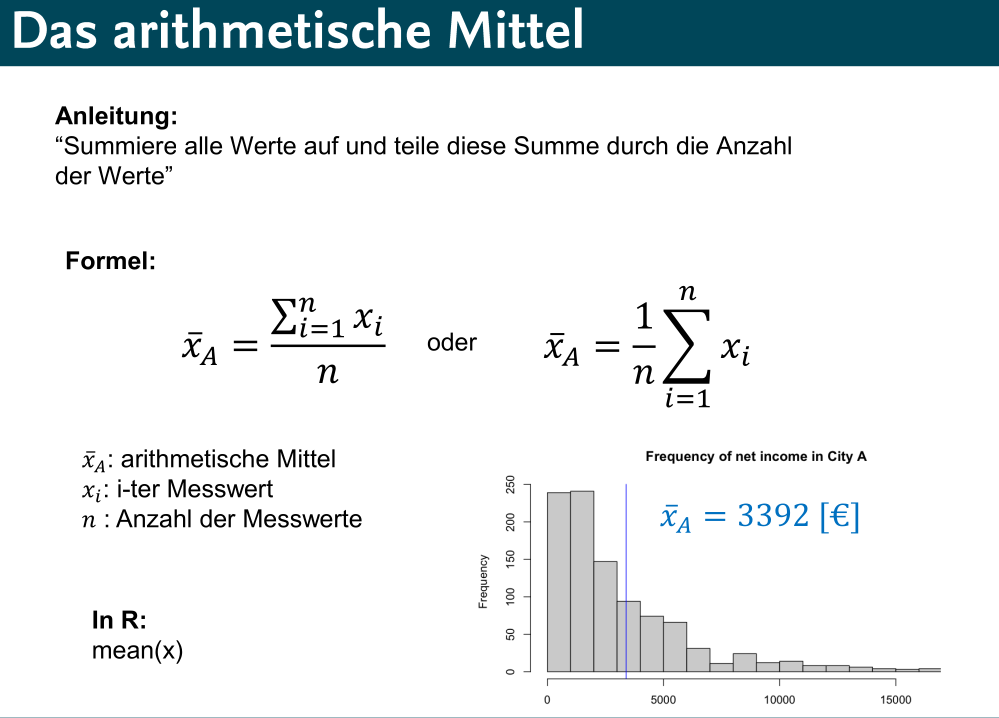
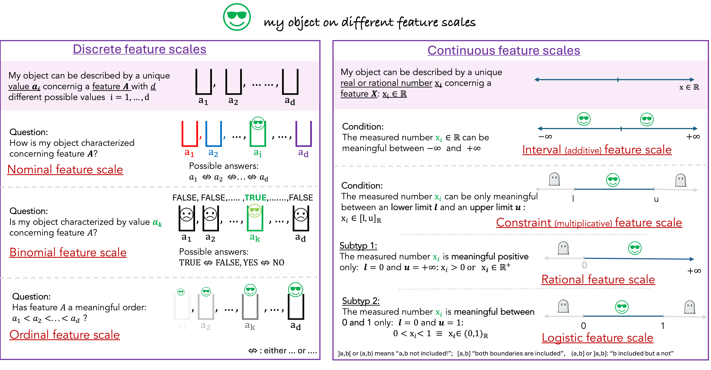
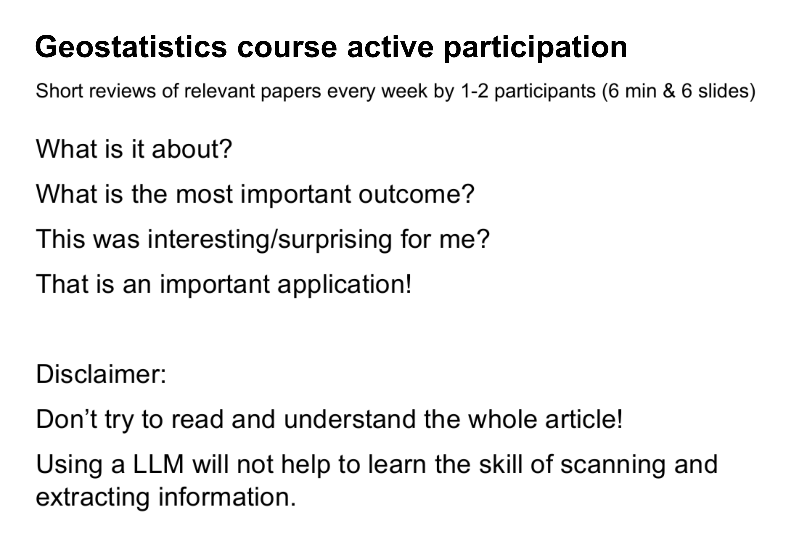

Die Arbeit von GeoStat zeigt: Ko-kreative Lehrentwicklung verändert die Lernkultur! Durch unsere neuen Methoden und Materialien haben wir beobachtbare Effekte erzielt, die uns Mut machen.

## Studierende sind aktiver

Ein zentraler Erfolg ist die aktivere Beteiligung der Studierenden: Sie stellen mehr Fragen, äußern Unsicherheiten offen und engagieren sich lebhafter in Diskussionen. Das liegt auch an unseren Navigationshilfen und Arbeitspraktiken, die wir gemeinsam entwickelt haben.

## Navigationshilfen fürs Lernen

Im Folgenden stellen wir drei konkrete Beispiele aus unserer Arbeit vor.

### (1) Übersetzungs-Folien als Einführung ins ‚Gelände‘

Dieser Folientyp erleichtern den Einstieg in das ‚Gelände Statistik‘. So übersetzt die folgende Folie die Formel für das arithmetischen Mittel in natürliche Sprache. Zusätzlich wird der Code für die Programmiersprache R gezeigt sowie ein Histogramm als visuelle Darstellung.

{fig-alt="Übersetzungsfolie: Arithmetisches Mittel" style="border: 1px solid #ddd; border-radius: 4px;" width="600"}

Das Produkt reagiert auf den Bedarf von Studierenden, die
Schwierigkeiten haben, komplexe statistische Formeln zu verstehen und
anzuwenden. Durch die Übersetzung der Formeln in einfache Sprache,
kombiniert mit praktischen Beispielen und R-Code, sollen Sprachbarrieren
abgebaut, das Verständnis verbessert und die praktische Anwendung
erleichtert werden.

### (2) Wissenskarten zur Orientierung

Wissenskarten sind mehrdimensionale Visualisierungen eines spezifischen Teilgebiets der Statistik. Sie helfen Studierenden, komplexe Inhalte zu verstehen und geben einen Überblick über Zusammenhänge, die sonst schwer fassbar wären. Die folgende Grafik kartiert verschiedene Skalenniveaus von Merkmalen. Skalenniveaus sind in der Statistik wichtig, weil sie bestimmen, welche mathematischen Operationen und statistischen Analysemethoden auf die Daten angewendet werden können. Auf unserer Karte wird jede Skala durch spezifische Fragen und Bedingungen charakterisiert, die beschreiben, wie Objekte oder Werte in Bezug auf das jeweilige Merkmal klassifiziert oder gemessen werden können.

Evaluationen, Interviews und Beobachtungen haben gezeigt, dass Studierende sich einfache ‚Rezepte‘ wünschen, die ihnen die Anwendung statistischer Konzepte erleichtern. Gleichzeitig ist ein Grundverständnis der statistischen Konzepte notwendig, um das richtige Rezept auszuwählen. Die Wissenskarten sollen den Lernenden einen Überblick verschaffen und ihnen so acuh das Verständnis erleichtern.

### (3) Blitzpräsentationen zur Aktivierung

Aktivierende Maßnahmen fordern die Studierenden dazu heraus, selbst tätig zu werden und das gelernte anzuwenden. Ein Beispiel sind die Blitz-Präsentationen in der MSc-Vorlesung *Geostatistik*. Dabei präsentieren Studierende paradigmatische wissenschaftliche Papers der Statistik in einem Pecha-Kucha-Format (6 Folien in 6 Minuten).

{style="border: 1px solid #ddd; border-radius: 8px;" fig-alt="Folie Blitzpräsentation" width="600"}

Diese konkrete Aktivierungsmaßnahme ging aus der Beobachtung hervor, dass Studierende in ihren Hausarbeiten (Abschlussprüfung im MSc-Modul) kaum wissenschaftliche Paper zitieren. Sie sollten durch die Präsentationen den Umgang mit wissenschaftlicher Literatur bereits während des Semesters üben. Die Präsentationen hatten außerdem den Effekt, dass die Vorlesung aufgelockert wurde und auch die zuhörenden Studierenden viel präsenter teilnahmen.

## Motiviertere Lehr-Lern-Kultur

Diese Ansätze führen nicht nur zu besseren Prüfungsergebnissen, sondern auch zu einer sichtbaren Veränderung der Lehr- und Lernkultur. Studierende sehen Statistik nicht mehr als unüberwindbares Hindernis, sondern als reizvolles Gelände, das wir mit geeinter Kraft und den richtigen Werkzeugen erkunden können.

Doch was nehmen wir aus diesen Erfahrungen mit? Welche Lessons Learned ziehen wir daraus – und wie können wir unser Vorgehen weiter verbessern?
