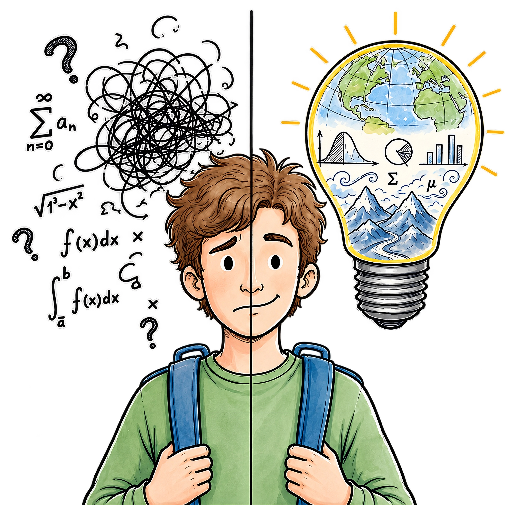

{width="1500"}

# Ausgangslage

Geowissenschaftler:innen spielen eine zentrale Rolle bei der Erforschung globaler Herausforderungen wie dem Klimawandel, Ressourcenknappheit und Migration. Die rasant steigende Menge entsprechender Daten erfordert anspruchsvolle Methoden der Datenanalyse, die weit über klassische Statistikausbildungen hinausgehen.

Doch der Aufstieg zu diesen komplexen mathematischen Konzepten und der Programmierung schreckt viele ab – insbesondere Studierende mit **Matheangst** stehen oft vor unüberwindbaren Hürden.

**Unser Expeditionsziel:** Wir wollen das ‚Gelände‘ der Statistiklehre in einen lebendigen, barrierefreien Erfahrungsraum transformieren. Studierende sollen sich von passiven „Tourist:innen“ zu aktiven **Ko-Kartograph:innen** entwickeln, die Verantwortung für ihren eigenen Lernweg übernehmen und sich souverän im Datenraum orientieren

Die Geowissenschaften befassen sich mit globalen Herausforderungen, wie Klimawandel, Ressourcenknappheit oder Migration. Die hierfür rasant steigende Menge an Geodaten erfordert anspruchsvolle Methoden der Datenanalyse, die weit über die Inhalte klassischer Statistikausbildung hinausgehen. Für die automatisierte Erkennung von Mustern in riesigen Datenmengen (Big Data) müssen Geowissenschaftler:innen über alle Berufsfelder hinweg Verfahren des Maschinellen Lernens (ML) und der künstlichen Intelligenz (KI) als modernes Handwerkszeug beherrschen.\
Die Komplexität der Prozessabläufe in der Geodatenanalyse setzt zunehmend ein Verständnis des mathematischen Hintergrundes sowie dessen programmiertechnischer Umsetzung voraus (u.a. [Wu, 2024](https://link.springer.com/article/10.1007/s12561-024-09454-5)) . Eine moderne Statistikausbildung steht daher vor der anspruchsvollen Aufgabe, Studierenden zusätzliche Fähigkeiten und Fertigkeiten in Mathematik und Informatik zu vermitteln.

# Handlungsfelder

Das Projekt „Geostatistische Grundlagenbildung ko-kreativ“ (GeoStat) nimmt sich dieser Herausforderungen an und will neue Wege in der Ausbildung von Datenanalysekompetenzen gehen. Dabei werden drei Handlungsfelder bearbeitet.

### (1) Lernhürden und Lernstrategien

Identifizierung von Lernhürden im Kontext mathematischer Grundlagen, Entwicklung von Bewältigungsstrategien sowie Unterstützung selbstgesteuerter Lernprozesse. Dabei folgt die Arbeit im Projekt dem iterativ-zyklischen Ansatz des forschenden Entwerfens ([Reinmann et al. 2024](https://www.transcript-verlag.de/978-3-8376-7424-8/forschendes-entwerfen/?number=978-3-8394-7424-2)), wobei der Fokus auf der evidenzbasierten Entwicklung und der formativen Evaluation praxisorientierter Lösungen liegt. Ziel ist es, die Bedürfnisse der Studierenden besser zu verstehen und diese in der Weiterentwicklung der Statistiklehre stärker zu berücksichtigen.

### (2) Lehrinhalte

Reorganisation/Fokussierung der Lehrinhalte in Bachelor- und Masterstudiengängen zur Entwicklung von Fähigkeiten und Fertigkeiten im Bereich ML. In Kooperation mit dem [Partnerprojekt GeoKI](https://stiftung-hochschullehre.de/projekt/geoki/) werden auf Machine Learning ausgerichtete Verfahrensschritte erarbeitet. Dabei steht insbesondere die Berücksichtigung von Datentransformationen im Fokus, die eine nachhaltige Qualität datenbasierter Forschungsergebnisse gewährleisten. Hieraus sollen zentrale Aspekte und Konzepte als unverzichtbare Lehrinhalte identifiziert werden.

### (3) Selbstlern-Material

Weiterentwicklung einer [Selbstlernumgebung](https://www.geo.fu-berlin.de/en/v/soga/) zur Geodatenanalyse in den Programmiersprachen R & Python. Im Projekt entwickelte Inhalte und Konzepte werden projektbegleitend in das bereits etablierte [E-Learning-Projekt SOGA](https://www.geo.fu-berlin.de/en/v/soga/) integriert und in der Lehre getestet und evaluiert.

### Kokreative Lehrentwicklung 

In allen drei Handlungsfeldern arbeiten Studierende, Lehrende, Forschende und Hochschuldidaktiker:innen in einem ko-kreativen Prozess eng zusammen. Die gemeinsam erarbeiteten Strategien werden außerdem in Weiterbildungsworkshops für Promovierende und PostDocs getestet und evaluiert.

# Präsentation auf dem UFF 202
