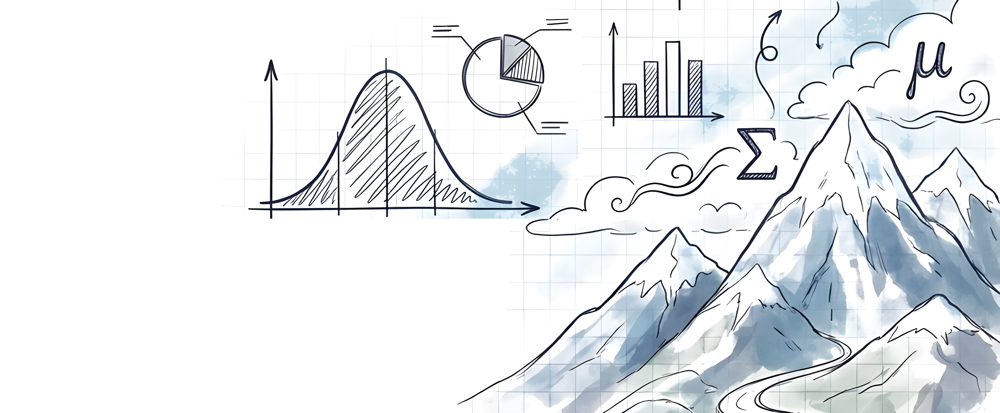
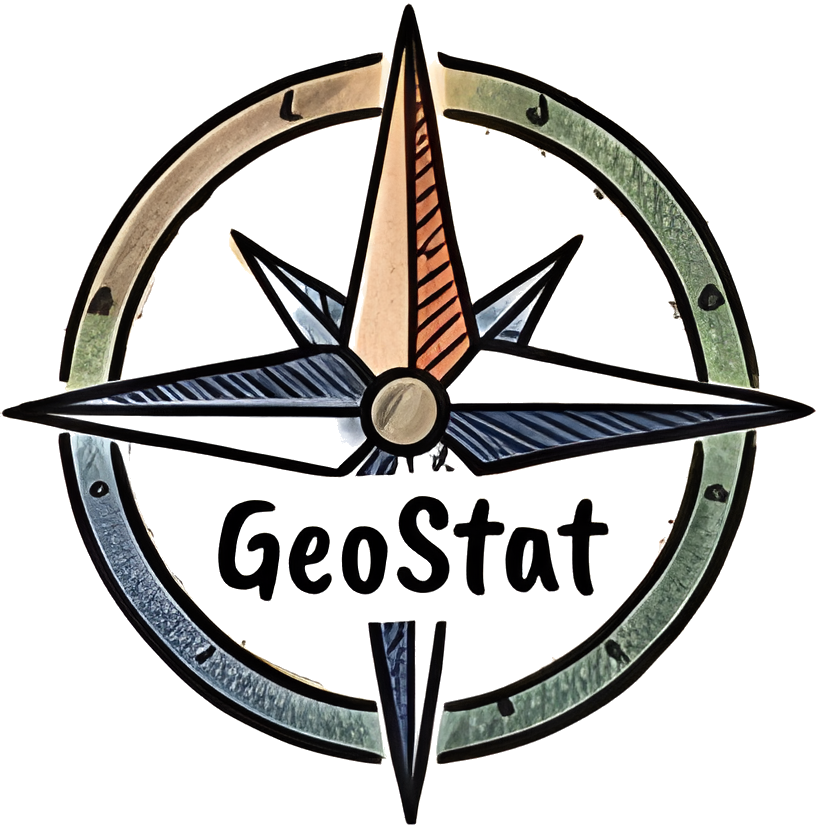

Die Anforderungen an die quantitative Ausbildung in den Geowissenschaften steigen rasant: Big Data, Machine Learning und komplexe Datenanalysen gehören heute zum Arbeitsalltag von Geograf:innen. Doch während der Bedarf an statistischen Kompetenzen wächst, scheitern viele Studierende an den Hürden der traditionellen Statistik-Lehre.

## Statistik als beängstigende Hürde

{style="float: right; margin-right: 1rem; margin-bottom: 0.5rem; width=200" width="300"}

Rund 30 % der Erstis brechen das Statistik-Vorlesung bereits kurz nach Semesterbeginn ab – mit der Folge, dass sich ihr Studium um zwei Semester verlängert. Die Gründe sind vielfältig: Heterogene Vorkenntnisse in Mathematik und Matheangst stellen für viele eine schwer überwindbare Einstiegshürde dar. Die Stofffülle und das hohe Lehrtempo führen dazu, dass viele den Anschluss verlieren. Gleichzeitig wissen Studierende oft nicht, wie sie fehlendes Wissen selbstständig aufarbeiten können oder trauen sich nicht Fragen zu stellen. Veraltete Lehrbücher verschärfen das Problem zusätzlich.

Und nicht nur Studierende kämpfen mit der Statistik: Auch in der Forschung werden oft falsche oder unpassende Methoden angewendet – etwa wenn das arithmetische Mittel für beschränkte Skalen verwendet wird. Das führt zu verzerrten Ergebnissen und einem Vertrauensverlust in die Wissenschaft.

## Statistik als spannende Herausforderung

{style="float: left; margin-right: 1rem; margin-bottom: 0.5rem; width=200" width="200"}Hier setzt das Projekt GeoStat an: Im Fokus stehen zwei Lehrveranstaltungen – der B.Sc.-Kurs \*„Einführung in die Statistik“\* (ca. 100 Studierende) und der M.Sc.-Kurs \*„Geostatistik“\* (ca. 30 Studierende). Beide Kurse bestehen aus einer Vorlesung und einem PC-Seminar.

Unser Ziel ist es, die Statistik-Lehre zugänglicher, partizipativer und wirksamer zu gestalten. Statt Studierende als passive ‚Tourist:innen‘ zu behandeln, wollen wir sie zu aktiven ‚Ko-Kartograph:innen‘ machen – zu Gestalter:innen ihres eigenen Lernwegs, die Verantwortung für ihre Route übernehmen.

Unser Kern-Team besteht aus einem Fachwissenschaftler, einer Hochschuldidaktikerin und vier Studierenden. Gemeinsam kartographieren wir die ‚Landschaft Statistik‘: Wir entwickeln neue Methoden und Materialien, die als Wegweiser und Werkzeuge dienen.

Mit den richtigen Werkzeugen und in der Gruppe werden selbst komplexe Mathematik und abstrakte Programmierlogik zu spannenden Herausforderungen, die jede:r meistern kann. Denn Statistik soll Studierenden nicht als abstrakte Formelwüste oder undurchdringliches Dickicht erscheinen, sondern als eine faszinierende Landschaft, die sich erkunden und gestalten lässt.
