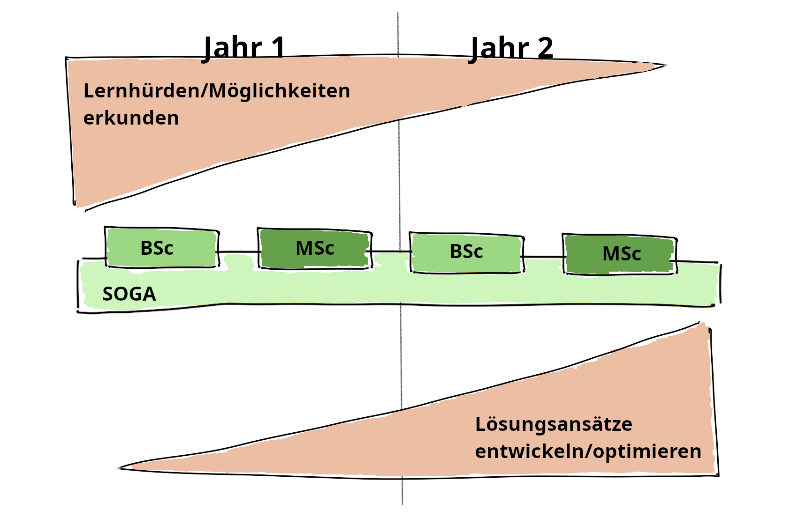
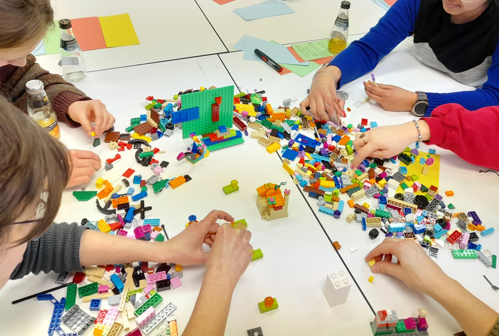

Unsere Arbeitsweise basiert auf Ko-Kreativität und Partizipation: Ein Fachwissenschaftler und eine Hochschuldidaktikerin arbeiten mit Studierenden als gleichberechtigten Partner:innen zusammen – ganz im Sinne von „Students as Partners“.

## Ansätze

Dabei orientieren wir uns an Ansätzen wie Design-Based Research, Decoding the Disciplines, die uns helfen, systematisch und evidenzbasiert Lösungen zu entwickeln.

- **Students as Partners** bedeutet für uns: Studierende sind nicht nur Lernende, sondern Mitgestalter:innen ihrer Lehre. Sie bringen ihre Perspektiven ein – etwa durch Feedback, kreative Workshops oder die Mitentwicklung von Materialien.
- **Design-Based Research** ermöglicht es uns, praktische Lösungen direkt in der Lehrveranstaltung zu erproben und kontinuierlich zu verbessern.
- **Decoding the Disciplines** hilft uns, fachspezifische Lernhürden zu identifizieren – etwa indem wir fragen: Wo scheitern Studierende typischerweise bei der Interpretation von p-Werten oder der Anwendung statistischer Tests?

Unser eklektisches Vorgehen kombiniert diese Ansätze flexibel, um die besten Methoden für unsere Ziele einzusetzen.

## Projekt-Karte

Bei einer Projektlaufzeit von zwei Jahren fokussieren wir uns im ersten Jahr auf das Erkunden von Lernhürden und Möglichkeiten für die anschließende Gestaltung der Navigationshilfen im zweiten Jahr.

## Schritt 1: Lernhürden erkunden

Gemeinsam erkunden wir zunächst die Lernhürden der Studierenden – etwa durch Online-Umfragen, Teaching Analysis Polls (TAP) oder quasi-ethnografische Beobachtungen in den Lehrveranstaltungen. Im Sinne von Decoding the Disciplines fragen wir gezielt: *Welche Denk- und Handlungsweisen der Statistik sind für Studierende besonders schwer zugänglich?* Die gesammelten Daten analysieren wir systematisch, um Muster und wiederkehrende Hürden zu identifizieren.

## Schritt 2: ‚Gelände‘ kartieren

Anschließend kartieren wir das ‚Gelände‘: Welche Inhalte stellen besonders große Hürden dar? In welchen Situationen erscheinen die Studierenden überfordert? Was hilft ihnen beim Lernen? Welche Tools und Ressourcen nutzen sie außerhalb der Lehrveranstaltung – und warum? Mit welchen Bildern und Metaphern beschreiben sie selbst die ‚Landschaft Statistik‘?

## Schritt 3: Navigationshilfen entwickeln

Darauf aufbauend entwickeln wir gezielt Navigationshilfen, die Studierende durch die ‚Landschaft Statistik‘ führen. Wie die genau aussehen beschreiben wir \[hier\](./produkte.qmd).

## Schritt 4: Erproben, reflektieren, verbessern

Unser Prozess ist zyklisch und reflexiv – ein Kernmerkmal von Design-Based Research: Wir erproben neue Materialien direkt in den Lehrveranstaltungen, evaluieren ihre Wirkung durch Feedback und Beobachtungen und verbessern sie kontinuierlich.

## Ko-kreativ zusammenarbeiten

{style="float: left; margin-right: 1rem; margin-bottom: 0.5rem;" width="400"}Werkzeuge wie Lego® Serious Play® helfen uns, kreative Ideen zu entwickeln und Studierende aktiv einzubinden. Zum Beispiel bauen wir gemeinsam 3D-Modelle der ‚Landschaft Statistik‘, um Lernhürden sichtbar zu machen oder Lösungsansätze zu skizzieren.

So entsteht eine dynamische Lehr-Lern-Kultur, in der alle Beteiligten – Lehrende wie Lernende – gemeinsam wachsen. Am Ende soll eine Statistik-Lehre entstehen, die nicht nur Wissen vermittelt, sondern auch Neugier weckt, Selbstvertrauen stärkt und dauerhaft im Gedächtnis bleibt – weil sie auf den echten Bedürfnissen und Perspektiven der Studierenden aufbaut.
